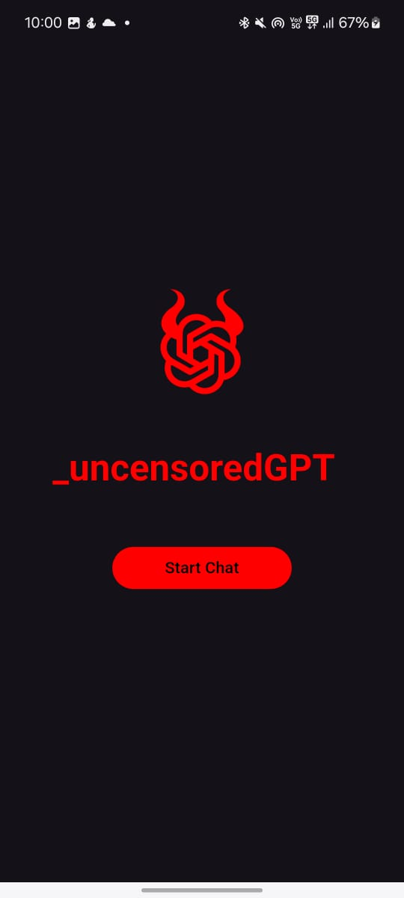

# _uncensoredGPT

---

### Disclaimer:

This AI-powered chat application generates responses based on machine learning models and does not guarantee accuracy, reliability, or appropriateness of content. Users may enter uncensored inputs, and the AI's responses are generated without human moderation.  

By using this app, you agree to the following:  
1. You are responsible for your inputs and how you interpret the AI's responses.  
2. The AI may generate content that is incorrect, biased, or inappropriate. Use discretion and verify critical information from reliable sources.  
3. This app is **not** a substitute for professional advice (legal, medical, financial, etc.).  
4. The developers are **not liable** for any harm, damages, or consequences resulting from the use of this application.  

If you encounter offensive or harmful content, please discontinue use.  

By continuing, you acknowledge and accept these terms.  

---

 

### Overview

This is a generative AI-powered chat application that allows users to input uncensored text and receive AI-generated responses. The app is designed for open-ended conversations, idea generation, and interactive discussions.

### Features

- Uncensored text input for user queries.
- AI-generated responses based on a trained language model.
- Web-based interface using Flutter.
- Backend powered by Flask and Nginx, hosting the LLM model.
- Secure and efficient communication between client and server.

### For LLM Mode 
- The LLM model is currently hosting using the Kaggle notebook so if any one need access to the notebook email me: sakibdalal73@gmail.com